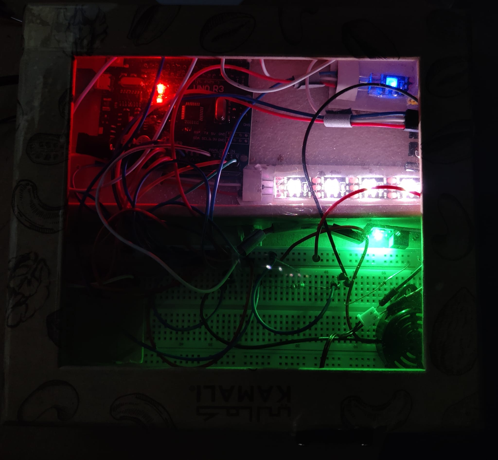

# 🖥️ Smart Desk Assistant

Welcome to the **Smart Desk Assistant** repository! This is a custom-built, Arduino-based embedded system designed to automate and enhance your daily workspace. By integrating multiple sensors and actuators, this device monitors ambient conditions and user presence to automatically manage desk lighting, temperature, and healthy work habits.

## 📖 Project Overview

Working at a desk for long hours often leads to poor lighting conditions, lack of movement, and uncomfortable temperatures. This original project solves these everyday issues without relying on expensive, inflexible commercial IoT devices. 

The Smart Desk Assistant actively monitors the environment and automatically triggers specific hardware responses (LEDs, fans, buzzers) to keep the user comfortable and productive. The system is designed to be highly modular, low-cost, and easily customizable.

## ✨ Key Functionalities

* **💡 Smart Ambient Lighting:** Utilizes a Light Dependent Resistor (LDR) to monitor room brightness. When it gets too dark, the system automatically turns on an addressable RGB LED strip. It uses a **hysteresis algorithm** (different thresholds for turning on and off) to prevent the lights from flickering when ambient light fluctuates slightly.
* **🚶 Inactivity & Posture Reminder:** Uses a PIR motion sensor to track user presence. If the user remains completely still or absent for a set duration (e.g., a reminder to stand up and stretch every 60 minutes), an independent RGB LED changes from a breathing blue to a flashing red, accompanied by a buzzer alarm. *(Note: Threshold is set to 10 seconds in the code for quick demonstration purposes).*
* **🌡️ Automated Cooling System:** Continuously reads the room temperature using an I2C temperature sensor. If the temperature exceeds a predefined comfort threshold (e.g., 15°C for demo purposes), a DC fan is automatically activated in an intermittent cooling cycle (10s ON / 10s OFF) to cool the workspace.

## 🧰 Hardware Components

To build this project, the following components were used:
* **Microcontroller:** Arduino Uno (or compatible board)
* **Sensors:**
  * PIR Motion Sensor
  * LDR (Photoresistor)
  * Temperature Sensor (BMP series / I2C protocol)
* **Actuators & Outputs:**
  * Addressable RGB LED Strips (e.g., WS2812B / Neopixels)
  * 5V DC Fan / Motor
  * Active Buzzer
* **Electronic Components:**
  * NPN Transistor (used to safely drive the DC fan)
  * Flyback Diode (for motor protection)
  * Resistors (for the LDR voltage divider and transistor base)
  * Breadboard & Jumper Wires

## 📸 Schematic & Pictures

Here is a look at the hardware setup:

  
*Above: The physical prototype of the Smart Desk Assistant in action.*

## 💻 Software Implementation

The logic is written entirely in **C++** using the Arduino IDE. 
* The code is modularly structured, with separate functions handling different sensors (`readLight()`, `checkMotion()`, `monitorTemp()`).
* The `loop()` function relies on non-blocking delay logic (using `millis()`) so that the lighting, cooling, and motion timers can run concurrently without freezing the microcontroller.
